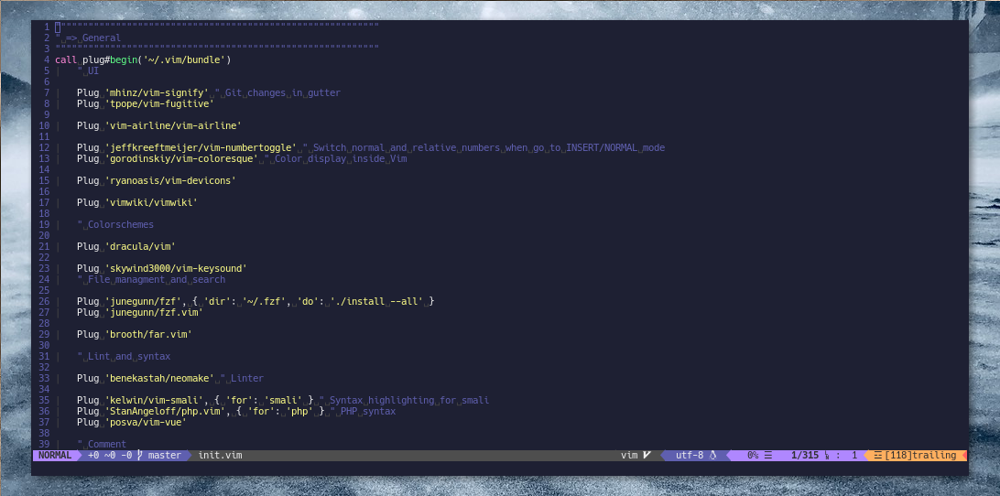

# My Vim config



## Table of contents

<!-- vim-markdown-toc GFM -->

* [Stack](#stack)
* [Install](#install)
* [Layout](#layout)

<!-- vim-markdown-toc -->

## Stack

* Plugin manager: [vim-plug](https://github.com/junegunn/vim-plug), with per-filetype/per-command lazy loading for language and utility plugins
* LSP: native neovim LSP via [nvim-lspconfig](https://github.com/neovim/nvim-lspconfig), servers installed by [mason.nvim](https://github.com/mason-org/mason.nvim) (`:Mason`, `<space>e`)
* Completion: [nvim-cmp](https://github.com/hrsh7th/nvim-cmp) — `Tab` to open/cycle, `Enter` to confirm, `<C-Space>` to trigger
* Syntax highlighting: [nvim-treesitter](https://github.com/nvim-treesitter/nvim-treesitter) (`main` branch), with regex syntax plugins only for languages without a parser (smali, vcl, caddy, haproxy, logstash, cql, openscad, blade)
* Statusline: [lualine.nvim](https://github.com/nvim-lualine/lualine.nvim) with dracula theme, native diagnostics + LSP status
* Git: [gitsigns.nvim](https://github.com/lewis6991/gitsigns.nvim) for the gutter, [fugitive](https://github.com/tpope/vim-fugitive) + [gv.vim](https://github.com/junegunn/gv.vim) for everything else
* Fuzzy finding: [fzf.vim](https://github.com/junegunn/fzf.vim) (`<C-p>` files, `<M-p>` ripgrep)
* AI: [copilot.vim](https://github.com/github/copilot.vim) inline suggestions (`<S-Tab>` to accept); chat/agent work happens in Claude Code, not in vim
* Go: [vim-go](https://github.com/fatih/vim-go) for tooling (`:GoTest`, `:GoFillStruct`, delve) — its LSP features are disabled in favor of native gopls

Key LSP bindings (leader is `,`): `gd`/`gy`/`gi`/`gr` gotos, `K` hover, `[c`/`]c` diagnostics, `<leader>rn` rename, `<leader>a`/`<leader>s` code actions, `<leader>f`/`:Format` format, `<space>a` diagnostic list, `<space>o`/`<space>s` symbols, `<leader>jsd` doc comments (Neogen).

Note on version managers: init.vim resolves the global asdf node once at startup and prepends its bin dir to `PATH`, so language servers are immune to projects pinning old node versions via `.tool-versions`.

## Install

Requirements:

* neovim (recent; treesitter uses the `main` branch which needs 0.11+)
* node (copilot.vim and the JS-based language servers)
* `tree-sitter` CLI (`npm install -g tree-sitter-cli` or `pacman -S tree-sitter-cli`) — needed to compile treesitter parsers
* `ag` (the_silver_searcher) — default fzf file source
* `rg` (ripgrep) — `:Rg` grep

Then:

```bash
git clone git@github.com:nemanjan00/vim.git
cd vim
./install.sh
```

Open nvim and run `:PlugInstall`. Treesitter parsers and language servers (mason `ensure_installed`) install themselves on first start.

## Layout

* `init.vim` — plugin list and main config (LSP/cmp/treesitter setup in the lua block at the end)
* `keybindings.vim` — all mappings (leader is `,`)
* `essentials/` — baseline settings that should be defaults
* `functions/` — small helper functions (window moving, fzf)
* `ftplugin/` — per-filetype settings (e.g. smali fold-away of `.line` directives)
* `coc/`, `coc-settings.json` — legacy coc config, kept only to make reverting the native-LSP migration easy; delete once the new stack has proven itself
* `templates/` — skeleton files for new `*.html` / `*.c` buffers
* `secrets.vim` — sourced if present, not tracked
